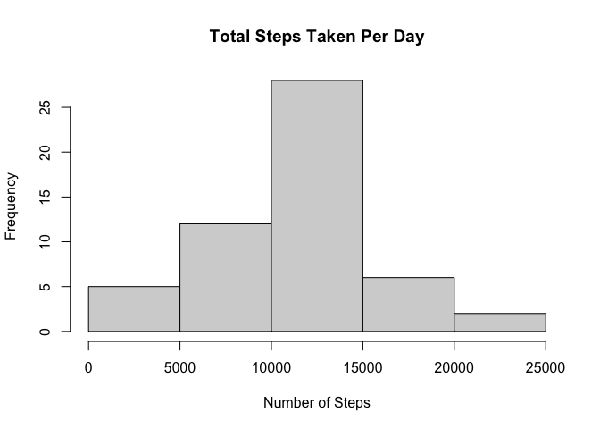
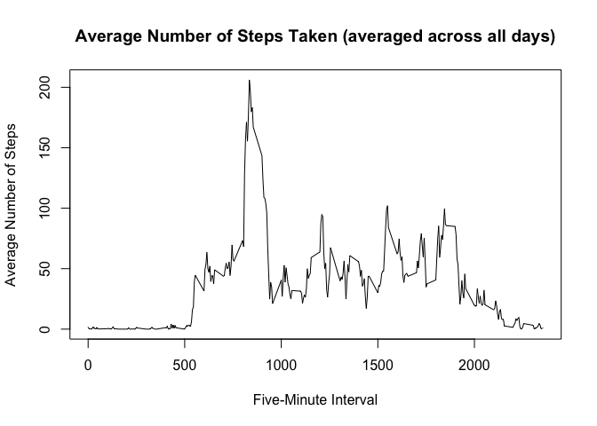
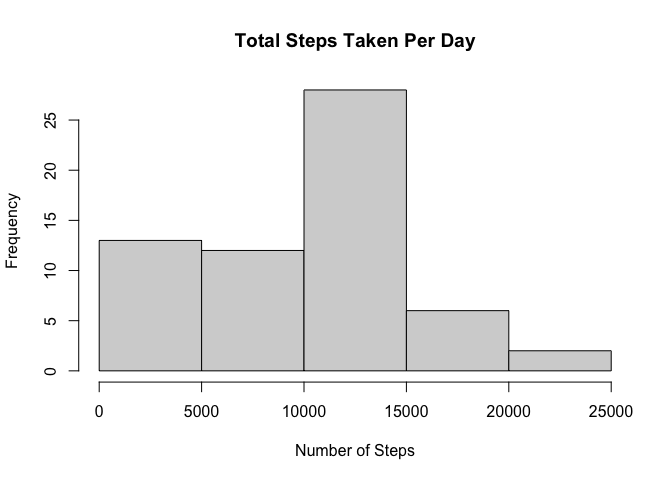
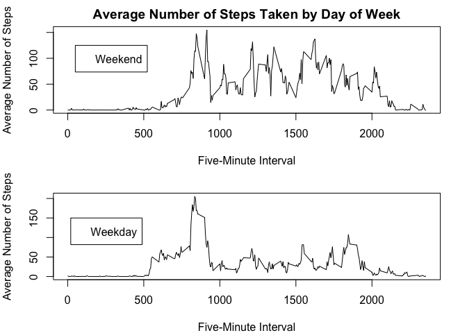

```r
library(tidyverse)
```

```
## ── Attaching core tidyverse packages ──────────────────────── tidyverse 2.0.0 ──
## ✔ dplyr     1.1.3     ✔ readr     2.1.4
## ✔ forcats   1.0.0     ✔ stringr   1.5.0
## ✔ ggplot2   3.4.3     ✔ tibble    3.2.1
## ✔ lubridate 1.9.2     ✔ tidyr     1.3.0
## ✔ purrr     1.0.2     
## ── Conflicts ────────────────────────────────────────── tidyverse_conflicts() ──
## ✖ dplyr::filter() masks stats::filter()
## ✖ dplyr::lag()    masks stats::lag()
## ℹ Use the conflicted package (<http://conflicted.r-lib.org/>) to force all conflicts to become errors
```

```r
library(knitr)
library(rmarkdown)
```

```
## Warning: package 'rmarkdown' was built under R version 4.3.1
```


```r
knitr::opts_chunk$set(echo = TRUE, include=TRUE)
```

Load and process the raw data

```r
rawdata<-read.csv("activity.csv", header = TRUE, sep=",")
rawdata$date <- as.Date(rawdata$date, format="%Y-%m-%d")
```

---

Calculate totals, mean, and median number of steps per day

```r
tabdata <-subset(rawdata, is.na(steps)==FALSE,1:2) %>%
  group_by(date) %>%
  summarize(Total_Steps=sum(steps,na.rm=TRUE))
  hist(tabdata$Total_Steps, main="Total Steps Taken Per Day", xlab="Number of Steps", ylab="Frequency")
```

<!-- -->

The mean and median number of steps taken per day were **10766.19** and **10765**, respectively.

---

# What is the average daily activity pattern?


```r
tabdata2<- rawdata %>%
  group_by(interval) %>%
  summarize(mean_steps=mean(steps, na.rm=TRUE))

plot(tabdata2$interval, tabdata2$mean_steps, pch=2, type="l", main="Average Number of Steps Taken (averaged across all days)", ylab="Average Number of Steps", xlab="Five-Minute Interval")
```

<!-- -->

The 5-minute interval, on average across all the days in the dataset, that contains the maximum number of steps is interval **835**.

---
# Imputing missing values

The total number of missing values in the dataset (i.e. the total number of rows with NAs) is **2304**.

Missing values will be imputed using the median across all days for an interval


```r
  tabdata3 <- rawdata %>%
  group_by(interval) %>%
  summarize(median_steps=median(steps, na.rm=TRUE))
  rawdata_merge <- merge(rawdata,tabdata3, by="interval", sort=FALSE)
  rawdata_merge <- arrange(rawdata_merge, date,interval)
  indices_na <- which(is.na(rawdata$steps)==TRUE)
  rawdata_nona <- rawdata_merge
  rawdata_nona[indices_na,"steps"] <- rawdata_merge[indices_na,"median_steps"]
  tabdata4 <- rawdata_nona %>%
    group_by(date) %>%
    summarize(Total_Steps=sum(steps,na.rm=TRUE))
  hist(tabdata4$Total_Steps, main="Total Steps Taken Per Day", xlab="Number of Steps", ylab="Frequency")  
```

<!-- -->


The mean and median number of steps taken per day were **9503.869** and **10395**, respectively. These values differ from the previously calculated estimates. Both of these values for the steps per day are higher than the values computed for the data without missing values imputed.


---

# Are there differences in activity patterns between weekdays and weekends?


```r
  rawdata_nona$weekday <- weekdays(rawdata_nona$date)
  rawdata_nona$weekday_fac <- factor((rawdata_nona$weekday %in% c("Saturday","Sunday")), levels=c("TRUE","FALSE"),labels=c("weekend","weekday"))
  
  tabdata5 <- rawdata_nona %>%
    select(-median_steps) %>%
    group_by(weekday_fac, interval) %>%
    summarize(mean_steps=mean(steps, na.rm=TRUE))
```

```
## `summarise()` has grouped output by 'weekday_fac'. You can override using the
## `.groups` argument.
```

```r
par(mfrow=c(2,1), mar=c(4, 4, 2, 2))
with(subset(tabdata5,tabdata5$weekday_fac=="weekend"),
plot(interval,mean_steps, pch=2, type="l", main="Average Number of Steps Taken by Day of Week",ylab="Average Number of Steps", xlab="Five-Minute Interval"))
legend(50,125,legend="Weekend")
with(subset(tabdata5,tabdata5$weekday_fac=="weekday"),
plot(interval,mean_steps, pch=2, type="l", ylab="Average Number of Steps", xlab="Five-Minute Interval"))
legend(20,150,legend="Weekday")
```

<!-- -->
 
Overall, the number of steps taken during the weekend are higher than on weekdays.
